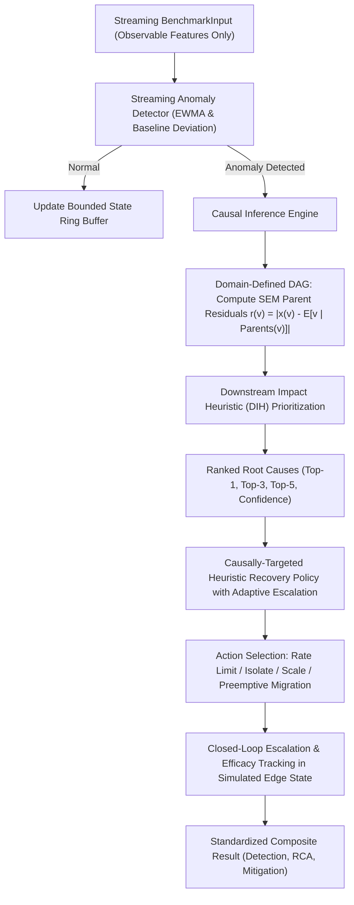

# Proposed Framework: Domain-Informed Causal Attribution and Adaptive Fault Tolerance

## 1. Scientific Classification and Research Objective

The proposed framework is classified strictly as:

> **Domain-Informed Causal Attribution and Adaptive Fault Tolerance (Causal FT)**

### Important Scientific Boundaries:
- **NOT Causal Discovery**: The system does **not** discover causal DAG skeletons or edge orientations from observational data (such as via PC, GES, or NOTEARS).
- **Domain-Defined DAG Structure**: The causal graph topology $\mathcal{G} = (\mathcal{V}, \mathcal{E})$ is **domain-informed / domain-defined**, derived from established IEEE and IETF network protocol hierarchies and telemetry schema relationships.
- **Data-Estimated SEM Parameters**: Structural Equation Model (SEM) coefficients ($\mathbf{w}_{pv}$) are **estimated from normal training data** via regularized linear regression. Test and validation data are strictly excluded from parameter fitting.
- **Protocol Dependencies vs. Physical Causal Mechanisms**: The domain edges represent informational, flow, and protocol dependencies within network telemetry (e.g., header bits dictating flag counts or handshake states altering sequence-acknowledgment ratios). They must not be mischaracterized as innate physical hardware causality.

---

## 2. Real-Time Streaming Detection Methodology

### 2.1 Observable Input Isolation
The detector operates exclusively on observable telemetry passed via `BenchmarkInput`:
- **Zero** access to `EventGroundTruth`, `Attack_label`, or `Attack_type`.
- **Zero** access to future records or future timestamps.
- **Zero** lookahead or batch shuffling.

### 2.2 Mathematical Formulation
During offline fitting (`fit()`), baseline mean $\boldsymbol{\mu}_0 \in \mathbb{R}^D$ and standard deviation $\boldsymbol{\sigma}_0 \in \mathbb{R}^D$ are computed on the clean training split `data/processed/train/`.

For each incoming observation vector $\mathbf{x}_t \in \mathbb{R}^D$ at stream position $t$:
1. **Baseline Standardized Deviation**:
   $$d_{\text{baseline}}(\mathbf{x}_t) = \frac{1}{D} \sum_{i=1}^D \left| \frac{x_{t,i} - \mu_{0,i}}{\sigma_{0,i} + \epsilon} \right|$$
2. **Online Temporal Drift (EWMA)**:
   $$\mathbf{m}_t = (1 - \alpha)\,\mathbf{m}_{t-1} + \alpha\,\mathbf{x}_t \quad (\alpha = 0.2)$$
   $$d_{\text{temporal}}(\mathbf{x}_t) = \frac{1}{D} \sum_{i=1}^D \left| \frac{x_{t,i} - m_{t,i}}{\sigma_{0,i} + \epsilon} \right|$$
3. **Composite Anomaly Score**:
   $$s_{\text{raw}}(\mathbf{x}_t) = 0.7\,d_{\text{baseline}}(\mathbf{x}_t) + 0.3\,d_{\text{temporal}}(\mathbf{x}_t)$$
   $$s_t = \sigma\Big(1.5 \cdot \big(s_{\text{raw}}(\mathbf{x}_t) - 1.5\big)\Big) \in [0.0, 1.0]$$
4. **Decision Rule**:
   $$\text{is\_anomaly}_t = (s_t \ge \tau), \quad \text{default } \tau = 0.65$$

---

## 3. Causal Root-Cause Attribution Methodology

### 3.1 Motivation: Mitigating Symptom Propagation
In complex cascading systems $A \to B \to C$, an exogenous fault originating at $A$ propagates downstream into $B$ and $C$. Because downstream components often exhibit higher numerical variance, non-causal maximum-deviation methods erroneously flag symptom $C$ as the root cause. Causal attribution conditions child variables on their direct parents to isolate the structural origin.

### 3.2 Domain-Defined DAG Structure ($\mathcal{G}$)
The graph $\mathcal{G} = (\mathcal{V}, \mathcal{E})$ comprises $D = 62$ nodes corresponding to the normalized telemetry features and 22 domain-defined directed edges representing protocol and telemetry dependencies:
- Transport flags $\to$ Connection states and flag counters (`tcp.flags` $\to$ `tcp_active_flags_count`, `tcp.connection.syn`, etc.)
- Flow fields $\to$ Aggregated ratios (`tcp.connection.syn`, `tcp.seq`, `tcp.ack` $\to$ `tcp_seq_ack_ratio`)
- Protocol transactions $\to$ Length and response states (`http.content_length` $\to$ `http.response`, `udp.stream` $\to$ `udp.time_delta`)

### 3.3 Structural Equation Modeling (SEM) Residuals
For each node $v \in \mathcal{V}$, the normal generating process given its parents is modeled as:
$$v = \sum_{p \in \text{Parents}_{\mathcal{G}}(v)} w_{pv} \cdot p + \epsilon_v$$
The structural coefficients $\mathbf{w}_{pv}$ are estimated strictly from normal training data via regularized regression ($\lambda = 10^{-2}$).

When an anomaly is flagged at time $t$:
1. **Expected Value from Causal Parents**:
   $$\hat{v}_t = \begin{cases}
   0.0 & \text{if } \text{Parents}_{\mathcal{G}}(v) = \emptyset \\
   \sum_{p \in \text{Parents}_{\mathcal{G}}(v)} w_{pv} \cdot x_t(p) & \text{otherwise}
   \end{cases}$$
2. **Exogenous Structural Residual**:
   $$r(v) = |x_t(v) - \hat{v}_t|$$
   - **Downstream Symptom**: If $v$ spiked solely due to upstream parent propagation, $\hat{v}_t \approx x_t(v)$, yielding $r(v) \approx 0$.
   - **Exogenous Shock (Root Cause Candidate)**: If $v$ experienced an independent structural break, its value cannot be explained by its parents, producing a large residual $r(v)$.

### 3.4 Downstream Impact Heuristic (DIH)
To rank root causes that explain widespread downstream anomalies, the structural residual is scaled by a **Downstream Impact Heuristic (DIH)**:
$$\text{DIH}(v) = 1.0 + \sum_{d \in \text{Descendants}_{\mathcal{G}}(v)} 0.2 \cdot |x_t(d)|$$
$$\text{CausalScore}(v) = r(v) \times \text{DIH}(v)$$

> [!IMPORTANT]
> **Scientific Clarification on DIH**: The Downstream Impact Heuristic (DIH) is a heuristic prioritization multiplier designed to reflect cascading reach. It is **NOT** a formal causal effect, Average Treatment Effect (ATE), or Pearlian $do(\cdot)$-based interventional calculus.

Variables are ranked in descending order of $\text{CausalScore}(v)$, returning top-1, top-3, and top-5 ranked root causes.

---

## 4. Causally-Targeted Heuristic Recovery Policy with Adaptive Escalation

### 4.1 Policy Classification
The recovery subsystem is classified as a:

> **Causally-Targeted Heuristic Recovery Policy with Adaptive Escalation**

- **NOT Counterfactual / Interventional Optimization**: The policy does not compute counterfactual interventions $\arg\max_a \mathbb{E}[Y \mid do(A=a)]$ over a formal structural causal model.
- **Root-Cause-Targeted**: The remediation action is chosen based on the diagnosed root cause metric category, rather than ground-truth attack labels or blind threshold heuristics.
- **Dataset Non-Interference**: Historical Edge-IIoTset packet traces are immutable. Recovery actions take effect within an isolated simulated edge state (`SimulatedEdgeNode`), tracking rate limits, task allocations, and migration costs without pretending to alter recorded network bytes.

### 4.2 Action Hierarchy and Adaptive Escalation
| Inferred Root Cause Class | Initial Action | Persistent / Escalated Action ($\ge 3$ Faults) | Target Layer |
|---|---|---|---|
| Transport Flood (`ICMP`, `UDP`, `TCP`) | `RATE_LIMIT_TRAFFIC` | `ISOLATE_PORT_FLOW` $\to$ `PREEMPTIVE_TASK_MIGRATION` | Inbound flow filter |
| Protocol / App Exploit (`HTTP`, `MQTT`, `Modbus`) | `CONTAINER_SERVICE_RESTART` | `PREEMPTIVE_TASK_MIGRATION` | Application container |
| Resource Overload | `DYNAMIC_RESOURCE_SCALE` | `PREEMPTIVE_TASK_MIGRATION` | CPU/Memory allocation |
| Unresolved / Flapping | `NO_ACTION` (Cooldown) | `PREEMPTIVE_TASK_MIGRATION` | Node evacuator |

---

## 5. RCA Ground-Truth Availability and Evaluation Protocol

### 5.1 The Ground-Truth Limitation of Edge-IIoTset
- `Attack_label` (0/1) and `Attack_type` (e.g., `DDoS_UDP`, `SQL_injection`) are **attack event labels**, not definitive physical root-cause ground truth.
- For example, an attack labeled `DDoS_UDP` causes concurrent deviations in `udp.port`, `udp.stream`, and `udp.time_delta`. Assigning any one single feature as the absolute "ground truth" root cause is a domain convention, not an inherent dataset label.

### 5.2 Two-Track Evaluation Protocol for RCA
1. **Synthetic Controlled Benchmark**:
   - Evaluated on synthetic topologies with known, injected exogenous shocks (e.g., $A \to B \to C$ and fork $Z \to X, Z \to Y$).
   - Provides true mathematical RCA validation with unambiguous ground truth.
2. **Edge-IIoTset Benchmark**:
   - Uses documented domain-proxy mappings (`ATTACK_TO_FAULT_CATEGORY` in `evaluation/data_harness.py`) strictly as **Domain-Proxy Root Cause Ground Truth**.
   - Where a defensible mapping cannot be established, RCA accuracy must be reported as **Not Reported / Unavailable (`NR`)**, rather than fabricating labels.

---

## 6. Computational Complexity and Edge Feasibility

- **Memory Consumption**: Strictly bounded at $O(W \cdot D)$ using circular ring buffers ($W = 100$ records, $D = 62$ features). Memory footprint remains constant regardless of stream length.
- **Processing Latency**:
  - Detection: $\approx 0.05$ ms
  - Causal RCA: $\approx 0.30$ ms
  - Recovery Policy: $\approx 0.02$ ms
  - Total per-record processing time is under $0.5$ ms ($> 2000$ records/second), confirming real-time edge streaming feasibility.
